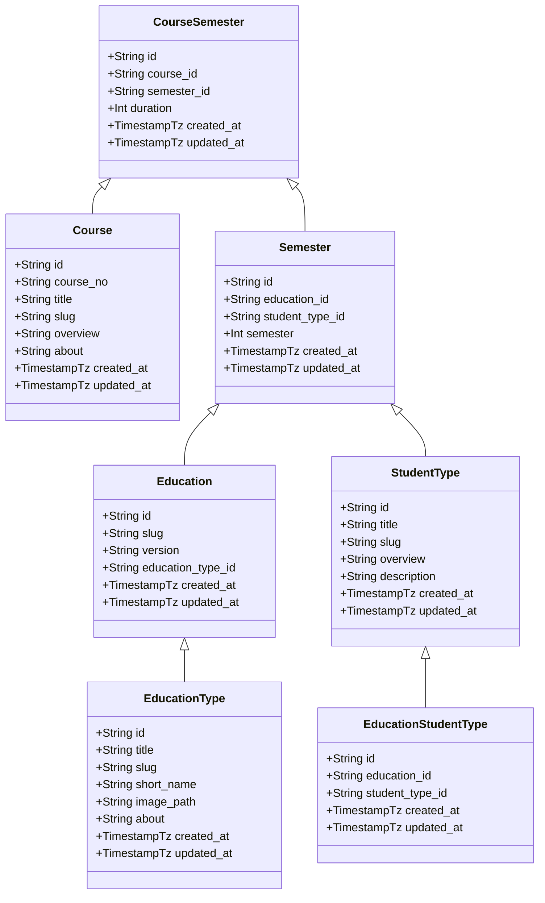

# CourseWire Specification

[TOC levels=1-3]: # "#### Table of Contents"
#### Table of Contents
- [Copyright Notice](#copyright-notice)
- [Revision](#revision)
- [Abstract](#abstract)
- [Terminology](#terminology)
- [Entity Diagram](#entity-diagram)
- [API](#api)
  - [Courses](#courses)
    - [Show Course](#show-course)
  - [Educations](#educations)
    - [Show Education](#show-education)
    - [Show Education Version](#show-education-version)
  - [Student Types](#student-types)
  - [Semesters](#semesters)
- [User interface](#user-interface)
  - [Design System](#design-system)
    - [Palette](#palette)
    - [Fonts](#fonts)
  - [Common Elements](#common-elements)
    - [Header](#header)
    - [Footer](#footer)
  - [Homepage](#homepage)
  - [Course Overview](#course-overview)
    - [Course Display](#course-display)
  - [Educations Overview](#educations-overview)
    - [Educations Display](#educations-display)
  - [Administration Dashboard](#administration-dashboard)
    - [Authentication](#authentication)
  - [Security Measures](#security-measures)
    - [Cross Site Request Forgery (CSRF)](#cross-site-request-forgery-csrf)
    - [Cross Origin Resource Sharing (CORS)](#cross-origin-resource-sharing-cors)
    - [Password Encryption](#password-encryption)
    - [TLS](#tls)
    - [Output escaping](#output-escaping)
- [Test Suite](#test-suite)
  - [Feature Testing](#feature-testing)
  - [Unit Testing](#unit-testing)
  - [Browser Testing](#browser-testing)
- [Demo](#demo)

## Copyright Notice

Copyright (C) Martin Juul (2020).  All Rights Reserved.

## Revision

| Version | Date       | Author      |
|:--------|:-----------|:------------|
| 1.0     | 16/11-2020 | Martin Juul |

## Abstract

This document describes the application _CourseWire_, a web application
meant as an aid in advertising educations. Initially built to serve this purpose
at _Syddansk Erhversskole Odense-Vejle_.

The public facing user interfaces are a Single Page Application (SPA),
which is the "public" part of the app. The other user interface is the
administration panel.

All subjects in the administration panel (courses, educations, etc.) is
available at the included HTTP API.

## Terminology

_The key words "MUST", "MUST NOT", "REQUIRED", "SHALL", "SHALL
NOT", "SHOULD", "SHOULD NOT", "RECOMMENDED",  "MAY", and
"OPTIONAL" in this document are to be interpreted as described in
[rfc2119](https://tools.ietf.org/html/rfc2119)_

The word _user_ describes either an unknown entity or a user with administrative
privileges, unless other is specified.

## Entity Diagram

<entity-diagram />

### Class diagram



## API

The HTTP API is available at `yourdomain.tld/api` exchanging messages encoded with JSON.

### Courses

Endpoint `yourdomain.tld/api/courses`

```json
{
  "data": [
    {
      "title": "string",
      "course_no": "string",
      "overview": "string|null",
      "about": "string|null",
      "duration": "string|null"
    }
  ]
}
```

#### Show Course

Endpoint `yourdomain.tld/api/courses/:slug`

```json
{
  "data": {
    "title": "string",
    "course_no": "string",
    "overview": "string|null",
    "about": "string|null",
    "duration": "string|null"
  }
}
```

### Educations

Endpoint `yourdomain.tld/api/educations`

```json
{
  "data": [
    {
        "title": "string",
        "short_name": "string",
        "slug": "string",
        "about": "string|null",
        "blur_hash": "string|null",
        "image": "string|null",
        "created": "datetimetz",
        "updated": "datetimetz"
    }
  ]
}
```

#### Show Education

Endpoint `yourdomain.tld/api/educations/type/:slug`

```json
{
  "data": {
    "title": "string",
    "short_name": "string",
    "slug": "string",
    "about": "string|null",
    "blur_hash": "string|null",
    "image": "string|null",
    "created": "datetimetz",
    "updated": "datetimetz"
  }
}
```

#### Show Education Version

Endpoint `yourdomain.tld/api/educations/:educationTypeSlug`

```json
{
  "data": {
    "parent": "string|omitted",
    "slug": "string",
    "version": "string"
  }
}
```

#### Show Education Versions

**Query Param**

| Parameter | Value    | Example |
|:----------|:---------|:--------|
| version   | `string` | `9.1`   |

```json
{
    "data": [
      {
        "parent": "string|omitted",
        "slug": "string",
        "version": "string"
      }
    ]
}
```

### Student Types

Endpoint `yourdomain.tld/api/student-types`

```json
{
  "data": [
    {
        "title": "string",
        "slug": "string",
        "overview": "string|null",
        "description": "string|null"
    }
  ]
}
```

### Semesters

Endpoint `yourdomain.tld/api/semesters/{educationSlug}/{studentTypeSlug}`

```json
{
  "data": {
    "semester": "int",
    "courses": [
      {
        "title": "string",
        "course_no": "string",
        "overview": "string|null",
        "about": "string|null",
        "duration": "int"
      }
    ]
  }
}
```

## User interface

The following sections describe the user interfaces available to the user.

### Design System

#### Palette

| Name       | SASS Variable | Hex     |
|:-----------|:--------------|:--------|
| Background | $white        | #ffffff |
| Primary    | $blue         | #006c80 |
| Secondary  | $cyan         | #4dd0e1 |
| Accent     | $orange       | #f6831e |
| Error      | $red          | #f6831e |
| Warning    | $yellow       | #ffeb3b |
| Info       | $blue-light   | #64b5f6 |
| Success    | $green        | #4caf50 |

#### Fonts

Serif font is the [Roboto](https://fonts.google.com/specimen/Roboto) by Google.

The icons chosen is the [Material Design Icons](https://material.io/resources/icons/?style=baseline).

### Common Elements

These elements is presented on all public pages.

#### Header

    +----------+--------+--------+---------------+--------------------------------------------------------+
    |          |        |        |               |                                                        |
    |  LOGO    |  Hjem  |   Fag  | Uddannelserne |                                                        |
    |          |        |        |               |                                                        |
    +----------+--------+--------+---------------+--------------------------------------------------------+

#### Footer

    +-------------------------------------------------------------------------------------+
    |       XX  XX  XX  XX                                                                |
    |       XX  XX  XX  XX                                        Copyright Notice        |
    +-------------------------------------------------------------------------------------+

Where each block of X's represents external links to branding pages (facebook, youtube, linkedin, website).

### Homepage

### Course Overview

#### Course Display

### Educations Overview

#### Educations Display


## Administration Dashboard

### Authentication


## Security Measures

Several technologies and web standards are enforced in the application.

### Cross Site Request Forgery (CSRF)

CSRF attacks happen due to maliciously crafted HTTP POST requests.
Thereby allowing cookies to be stolen.

Browsers have builtin security to protect against these attacks.
But are on case-by-case.


To protect against these attacks. A token is generated with each request.
The token is stored in the html body of the page. On each form request, this token is checked and validated.

This prevents these attacks. As the attacker has no way of knowing the value of the token, and is not able to inject
it in a user context.

### Cross Origin Resource Sharing (CORS)


### Password Encryption

Argon2 is modern ASIC-resistant and GPU-resistant secure key derivation function.
It has better password cracking resistance (when configured correctly) than PBKDF2, Bcrypt and Scrypt
(for similar configuration parameters for CPU and RAM usage).

The Internet Engineering Task Force (IETF) recommends using __Argon2id__ for new applications.
As described in [draft-irtf-cfrg-argon2-12](https://tools.ietf.org/html/draft-irtf-cfrg-argon2-12)

### TLS

All versions of SSL and TLS version 1.0 and 1.1 are __NOT__ to be used, when hosting the app.

This is due to these versions have been cracked. At minimum TLS 1.2 should be used,
and TLS 1.3 once stable.

[GlobalSign Disable TLS and All SSL versions](https://www.globalsign.com/en/blog/disable-tls-10-and-all-ssl-versions)

[PacketLabs TLS 1.1 No Longer Secure](https://www.packetlabs.net/tls-1-1-no-longer-secure/)

### Output escaping

To prevent mangling input data, a subset of html is allowed. This is escaped during the application output stage.
This way the users are protected from malicious script injections (XSS).

Removing these during input, would be a bad decision. As the HTML standard evolves, new ways to inject javascript naturally happens.
And it would encourage a bad practice. Because no matter what, we cannot entirely trust any user generated data.

Not encforcing escaping during output, would potentially expose users to risk. As in that case, the output would be "trusted".

## Test Suite

### Feature Testing

### Unit Testing

### Browser Testing

[Laravel Dusk](https://laravel.com/docs/8.x/dusk) is a testing utility built on top of [ChromeDriver](https://chromedriver.chromium.org/)
and [Selenium](https://www.selenium.dev/)

It allows defining tests in code, that nullifies any reason to spend time on manual testing.
Instead we write tests for what we would confirm visually.

The HomePage test below is a good example on how easy they are to write.

```php
<?php

namespace Tests\Browser;

use Laravel\Dusk\Browser;
use Tests\Browser\Pages\HomePage;
use Tests\DuskTestCase;

class HomePageTest extends DuskTestCase
{
    /**
     * A Dusk test example.
     *
     * @return void
     * @throws \Throwable
     */
    public function testBasicElements(): void
    {
        $this->browse(function (Browser $browser) {
            $browser->visit(new HomePage)
                ->assertSee('Bliv en af danmarks kommende talenter indenfor IT.')
                ->assertSee('IT-SUPPORTER')
                ->assertSee('DATATEKNIKER / PROGRAMMERING')
                ->assertSee('DATATEKNIKER / INFRASTRUKTUR');
        });
    }

    /**
     * Test education stepper
     *
     * @throws \Throwable
     */
    public function testStepper(): void
    {
        $this->browse(function (Browser $browser) {
            $browser->visit(new HomePage)
                ->waitForText('IT-SUPPORTER')
                ->click('@it-supporter')
                ->waitForText('EUD')
                ->click('@eud')
                ->waitForText('Hovedforløb')
                ->assertSee('Hovedforløb 1')
                ->assertSee('Objektorienteret programmering')
                ->assertSee('Serverteknologi webserver')
                ->assertSee('Linux rettet mod server og embedded')
                ->assertSee('Script programmering')
                ->assertSee('Hovedforløb 2')
                ->assertSee('App programmering II')
                ->assertSee('Serverteknologi Linux')
                ->assertSee('IT Service-Management II');
        });
    }
}

```

## Demo

[cw-dev.endoftheweb.pw](https://cw-dev.endoftheweb.pw)


