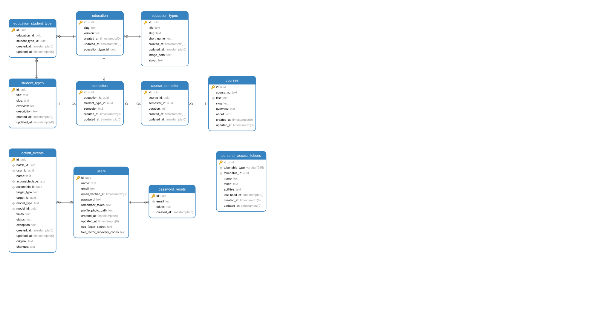

# CourseWire Specification

[TOC levels=1-3]: # "#### Table of Contents"
#### Table of Contents
- [Copyright Notice](#copyright-notice)
- [Revision](#revision)
- [Abstract](#abstract)
- [Terminology](#terminology)
- [Entity Diagram](#entity-diagram)
- [API](#api)
  - [Courses](#courses)
    - [Show Course](#show-course)
  - [Educations](#educations)
    - [Show Education](#show-education)
    - [Show Education Version](#show-education-version)
  - [Student Types](#student-types)
  - [Semesters](#semesters)
- [User interface](#user-interface)
  - [Design System](#design-system)
    - [Palette](#palette)
    - [Fonts](#fonts)
  - [Common Elements](#common-elements)
    - [Header](#header)
    - [Footer](#footer)
  - [Homepage](#homepage)
  - [Course Overview](#course-overview)
    - [Course Display](#course-display)
  - [Educations Overview](#educations-overview)
    - [Educations Display](#educations-display)
  - [Administration Dashboard](#administration-dashboard)
    - [Authentication](#authentication)
  - [Security Measures](#security-measures)
    - [Cross Site Request Forgery (CSRF)](#cross-site-request-forgery-csrf)
    - [Password Encryption](#password-encryption)
    - [TLS](#tls)
    - [Output escaping](#output-escaping)

## Copyright Notice

Copyright (C) Martin Juul (2020).  All Rights Reserved.

## Revision

| Version | Date       | Author      |
|:--------|:-----------|:------------|
| 1.0     | 16/11-2020 | Martin Juul |

## Abstract

This document describes the application _CourseWire_, a web application
meant as an aid in advertising educations. Initially built to serve this purpose
at _Syddansk Erhversskole Odense-Vejle_.

The public facing user interfaces are a Single Page Application (SPA),
which is the "public" part of the app. The other user interface is the
administration panel.

All subjects in the administration panel (courses, educations, etc.) is
available at the included HTTP API.

## Terminology

_The key words "MUST", "MUST NOT", "REQUIRED", "SHALL", "SHALL
NOT", "SHOULD", "SHOULD NOT", "RECOMMENDED",  "MAY", and
"OPTIONAL" in this document are to be interpreted as described in
[rfc2119](https://tools.ietf.org/html/rfc2119)_

The word _user_ describes either an unknown entity or a user with administrative
privileges, unless other is specified.

## Entity Diagram

    +------------------+      +-------------------+     +-----------------+    +-------------------+     +-------------------+
    |  courses         |      |  course_semester  |     |  semesters      |    |  education        |     |  education_types  |
    +------------------+      +-------------------+     +-----------------+    +-------------------+     +-------------------+
    | id               +---+  | id                | +---+ id              | +--> id                |  +--+  id               |
    | course_no        |   +--> course_id         | |   | education_id    <--+ | slug              |  |  |  title            |
    | title            |      | semester_id       +<- ->+ student_type_id |  | | version           |  |  |  slug             |
    | slug             |      | duration          | | | | semester        |  | | education_type_id +<-+  |  short_name       |
    | overview         |      | created_at        | +-+ | created_at      |  | | created_at        |     |  image_path       |
    | about            |      | updated_at        |   | | updated_at      |  | | updated_at        |     |  about            |
    | created_at       |      |                   |   | |                 |  | |                   |     |  created_at       |
    | updated_at       |      |                   |   | |                 |  | |                   |     |  updated_at       |
    +------------------+      +-------------------+   | +-----------------+  | +-------------------+     +-------------------+
                                                      |                      |
                                                      | +-----------------+  | +-------------------------+
                                                      | |  student_types  |  | |  education_student_type |
                                                      | +-----------------+  | +-------------------------+
                                                      +-+ id              <<-+ |  id                     |
                                                        | title           | |--+  education_id           |
                                                        | slug            | +--+  student_type_id        |
                                                        | overview        |    |  created_at             |
                                                        | description     |    |  updated_at             |
                                                        | created_at      |    |                         |
                                                        | updated_at      |    |                         |
                                                        +-----------------+    +-------------------------+

### Graphical



### Class diagram


## API

The HTTP API is available at `yourdomain.tld/api` exchanging messages encoded with JSON.

### Courses

Endpoint `yourdomain.tld/api/courses`

```json
{
  "data": [
    {
      "title": "string",
      "course_no": "string",
      "overview": "string|null",
      "about": "string|null",
      "duration": "string|null"
    }
  ]
}
```

#### Show Course

Endpoint `yourdomain.tld/api/courses/:slug`

```json
{
  "data": {
    "title": "string",
    "course_no": "string",
    "overview": "string|null",
    "about": "string|null",
    "duration": "string|null"
  }
}
```

### Educations

Endpoint `yourdomain.tld/api/educations`

#### Show Education

Endpoint `yourdomain.tld/api/educations/type/:slug`

#### Show Education Version

Endpoint `yourdomain.tld/api/educations/:educationTypeSlug`

### Student Types

Endpoint `yourdomain.tld/api/student-types`

### Semesters

Endpoint `yourdomain.tld/api/semesters`

## User interface

The following sections describe the user interfaces available to the user.

### Design System

#### Palette

| Name       | SASS Variable | Hex     |
|:-----------|:--------------|:--------|
| Background | $white        | #ffffff |
| Primary    | $blue         | #006c80 |
| Secondary  | $cyan         | #4dd0e1 |
| Accent     | $orange       | #f6831e |
| Error      | $red          | #f6831e |
| Warning    | $yellow       | #ffeb3b |
| Info       | $blue-light   | #64b5f6 |
| Success    | $green        | #4caf50 |

#### Fonts

Serif font is the [Roboto](https://fonts.google.com/specimen/Roboto) by Google.

The icons chosen is the [Material Design Icons](https://material.io/resources/icons/?style=baseline).

### Common Elements

These elements is presented on all public pages.

#### Header

    +----------+--------+--------+---------------+--------------------------------------------------------+
    |          |        |        |               |                                                        |
    |  LOGO    |  Hjem  |   Fag  | Uddannelserne |                                                        |
    |          |        |        |               |                                                        |
    +----------+--------+--------+---------------+--------------------------------------------------------+

#### Footer

    +-------------------------------------------------------------------------------------+
    |       XX  XX  XX  XX                                                                |
    |       XX  XX  XX  XX                                        Copyright Notice        |
    +-------------------------------------------------------------------------------------+

Where each block of X's represents external links to branding pages (facebook, youtube, linkedin, website).

### Homepage

### Course Overview

#### Course Display

### Educations Overview

#### Educations Display


## Administration Dashboard

### Authentication


## Security Measures

### Cross Site Request Forgery (CSRF)

### Password Encryption

### TLS

### Output escaping
